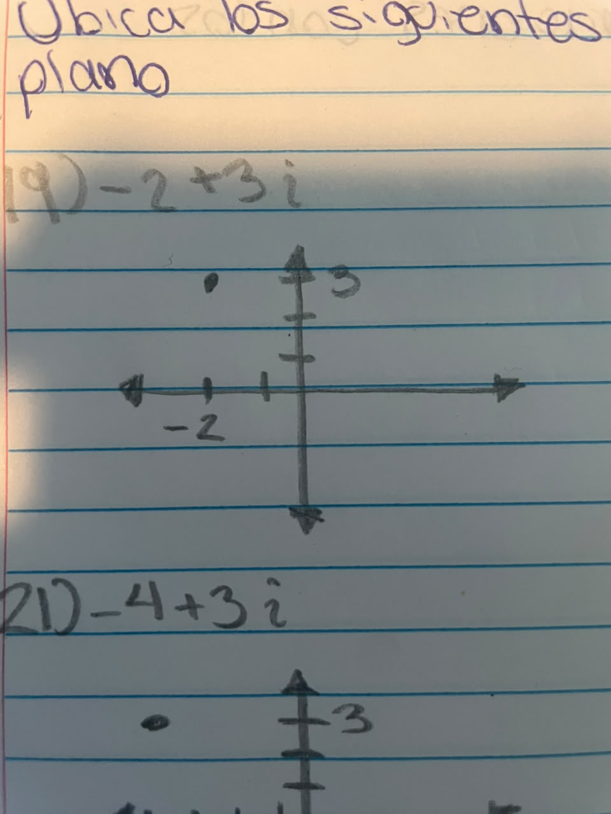
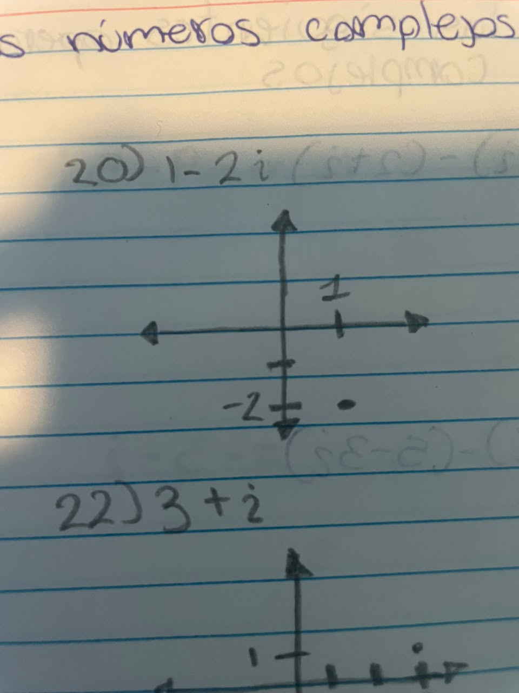
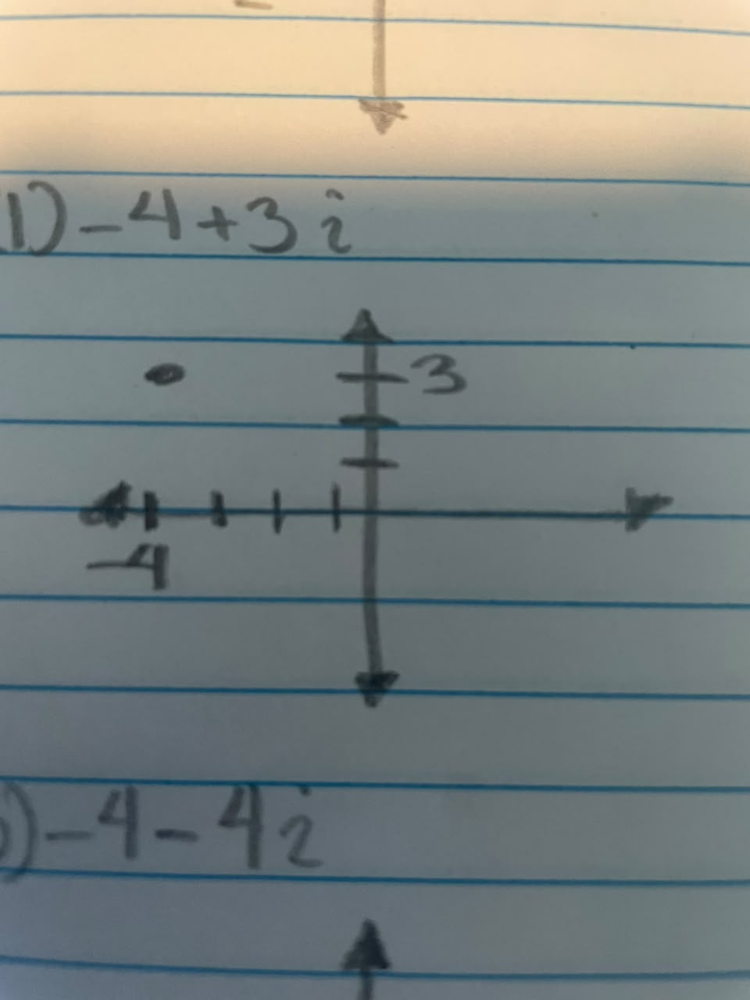
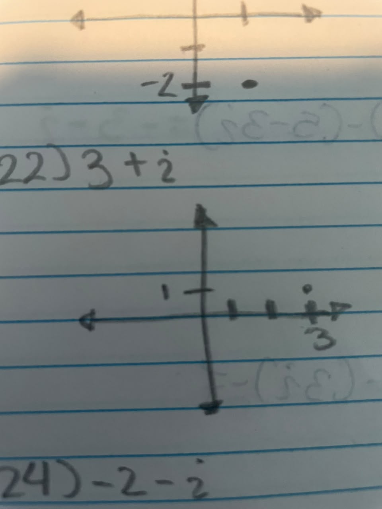
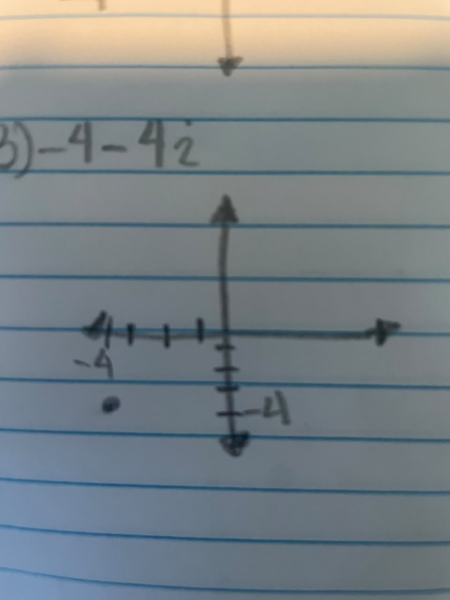
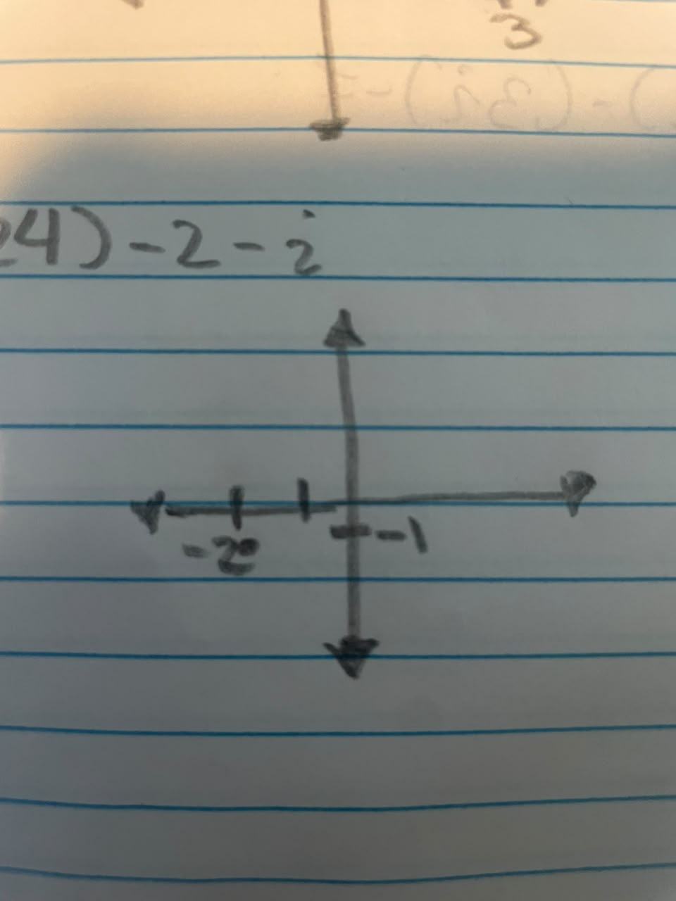

# Guía de Números Complejos

## 📌 Ubicación en el plano (Imagen 1)

Como no puedo dibujar directamente aquí, te explico en qué parte del plano de Gauss (Real, Imaginario) se ubica cada punto:

*   **19) $-2 + 3i$** : 
*   **20) $1 - 2i$** : 
*   **21) $-4 + 3i$** : 
*   **22) $3 + i$** : 
*   **23) $-4 - 4i$** : 
*   **24) $-2 - i$** : 

---

## RESUELVE LAS SIGUENTES OPERACIONES CON LOS NÚMEROS COMPLEJOS

*   **25)** $(-7 - 4i) - (2 + i) = -9 - 5i$
*   **26)** $(2 - 4i) - (5 - 3i) = -3 - i$
*   **27)** $(7 - 8i) - (3i) - 7 = 0 - 11i = -11i$
*   **28)** $(1 + 5i) + (-8 - 5i) + 3 = (1 - 8 + 3) + (5i - 5i) = -4$
*   **29)** $-8 - (3 - 5i) + (4 + 8i) = -8 - 3 + 5i + 4 + 8i = -7 + 13i$
*   **30)** $(-4 + 2i) + (3i) + (-4 - 7i) = -8 - 2i$
*   **31)** $(2i)(-4i) = -8i^2 = -8(-1) = 8$
*   **32)** $(-2i)(5i) \cdot 6 = (-10i^2) \cdot 6 = (10) \cdot 6 = 60$
*   **33)** $(-7i)(8 + 8i)(-2 - 8i) = (-7i)(-16 - 64i - 16i - 64i^2) = (-7i)(48 - 80i) = -336i + 560i^2 = -560 - 336i$
*   **34)** $(-2 - 4i)(-1 - 6i)(7 - 6i) = (-22 + 16i)(7 - 6i) = -154 + 132i + 112i - 96i^2 = -58 + 244i$
*   **35)** $(3i)(1 - 7i)(7 + 4i) = (3i)(7 + 4i - 49i - 28i^2) = (3i)(35 - 45i) = 105i - 135i^2 = 135 + 105i$
*   **36)** $(-6i)(-5 + i)(6 - 2i) = (-6i)(-30 + 10i + 6i - 2i^2) = (-6i)(-28 + 16i) = 168i - 96i^2 = 96 + 168i$

*   **37)** $\frac{10 - 7i}{1 + 3i} = \frac{(10 - 7i)(1 - 3i)}{(1 + 3i)(1 - 3i)} = \frac{10 - 30i - 7i + 21i^2}{1^2 + 3^2} = \frac{-11 - 37i}{10} = -1.1 - 3.7i$
*   **38)** $\frac{4 + 2i}{-1 - 10i} = \frac{(4 + 2i)(-1 + 10i)}{(-1 - 10i)(-1 + 10i)} = \frac{-4 + 40i - 2i - 20}{1 + 100} = \frac{-24 + 38i}{101}$
*   **39)** $\frac{1 + 4i}{-1 - 6i} = \frac{(1 + 4i)(-1 + 6i)}{(-1 - 6i)(-1 + 6i)} = \frac{-1 + 6i - 4i - 24}{1 + 36} = \frac{-25 + 2i}{37}$
*   **40)** $\frac{-8 + 4i}{1 + i} = \frac{(-8 + 4i)(1 - i)}{(1 + i)(1 - i)} = \frac{-8 + 8i + 4i + 4}{1 + 1} = \frac{-4 + 12i}{2} = -2 + 6i$
*   **41)** $\frac{-10 + 8i}{6 + i} = \frac{(-10 + 8i)(6 - i)}{(6 + i)(6 - i)} = \frac{-60 + 10i + 48i + 8}{36 + 1} = \frac{-52 + 58i}{37}$
*   **42)** $\frac{2 - 2i}{4 - 10i} = \frac{(2 - 2i)(4 + 10i)}{(4 - 10i)(4 + 10i)} = \frac{8 + 20i - 8i + 20}{16 + 100} = \frac{28 + 12i}{116} = \frac{7}{29} + \frac{3}{29}i$

---

## CALCULA EL VALOR ABSOLUTO DE LOS SIGUENTES NÚMEROS COMPLEJOS

*   **43)** $|-9 - 9i| = \sqrt{(-9)^2 + (-9)^2} = \sqrt{162} = 9\sqrt{2}$
*   **44)** $|8 - 6i| = \sqrt{8^2 + (-6)^2} = \sqrt{100} = 10$
*   **45)** $|6 - 3i| = \sqrt{6^2 + (-3)^2} = \sqrt{45} = 3\sqrt{5}$
*   **46)** $|10 + 10i| = \sqrt{100 + 100} = \sqrt{200} = 10\sqrt{2}$
*   **47)** $|6 - 10i| = \sqrt{36 + 100} = \sqrt{136} = 2\sqrt{34}$
*   **48)** $|-1 + 7i| = \sqrt{1 + 49} = \sqrt{50} = 5\sqrt{2}$

---

## RESUELVE LAS SIGUENTES POTENCIAS DE i

*   **49)** $i^5 = i^1 = i$
*   **50)** $i^{10} = i^2 = -1$
*   **51)** $i^{20} = i^0 = 1$
*   **52)** $i^{35} = i^3 = -i$
*   **53)** $i^{256} = i^0 = 1$
*   **54)** $i^{5^5}$ = $i^1 = i$

---

## Convertir a Forma Polar

*   **55) $6 - 8i$**  $\rightarrow r = 10, \theta \approx 306.87^\circ$. Resultado: $10(\cos 306.87^\circ + i\sin 306.87^\circ)$
*   **56) $5\sqrt{2} + 5\sqrt{2}i$** $\rightarrow r = 10, \theta = 45^\circ$. Resultado: $10(\cos 45^\circ + i\sin 45^\circ)$
*   **57) $2 - 2\sqrt{3}i$** $\rightarrow r = 4, \theta = 300^\circ$. Resultado: $4(\cos 300^\circ + i\sin 300^\circ)$
*   **58) $\frac{3\sqrt{3}}{2} - \frac{3i}{2}$** $\rightarrow r = 3, \theta = 330^\circ$. Resultado: $3(\cos 330^\circ + i\sin 330^\circ)$
*   **59) $-2$** $\rightarrow r = 2, \theta = 180^\circ$. Resultado: $2(\cos 180^\circ + i\sin 180^\circ)$
*   **60) $-7i$** $\rightarrow r = 7, \theta = 270^\circ$. Resultado: $7(\cos 270^\circ + i\sin 270^\circ)$

### Convertir a Forma Rectangular

*   **61)** $\cos 30^\circ + i \sin 30^\circ = \frac{\sqrt{3}}{2} + \frac{1}{2}i$
*   **62)** $2(\cos 60^\circ + i \sin 60^\circ) = 2(\frac{1}{2} + \frac{\sqrt{3}}{2}i) = 1 + \sqrt{3}i$
*   **63)** $1.5(\cos 90^\circ + i \sin 90^\circ) = 1.5(0 + i) = 1.5i = \frac{3}{2}i$
*   **64)** $2.5(\cos 120^\circ + i \sin 120^\circ) = 2.5(-\frac{1}{2} + \frac{\sqrt{3}}{2}i) = -\frac{5}{4} + \frac{5\sqrt{3}}{4}i$
*   **65)** $4(\cos 135^\circ + i \sin 135^\circ) = 4(-\frac{\sqrt{2}}{2} + \frac{\sqrt{2}}{2}i) = -2\sqrt{2} + 2\sqrt{2}i$
*   **66)** $3(\cos 180^\circ + i \sin 180^\circ) = 3(-1 + 0i) = -3$

---

## Raíces de Números Complejos

*   **67) 2 raíces cuadradas de $4(\cos 30^\circ + i\sin 30^\circ)$**
    *   $k=0$: $2(\cos 15^\circ + i \sin 15^\circ)$
    *   $k=1$: $2(\cos 195^\circ + i \sin 195^\circ)$
*   **68) 2 raíces cuadradas de $3(\cos 90^\circ + i\sin 90^\circ)$**
    *   $k=0$: $\sqrt{3}(\cos 45^\circ + i \sin 45^\circ)$
    *   $k=1$: $\sqrt{3}(\cos 225^\circ + i \sin 225^\circ)$
*   **69) 3 raíces cúbicas de $-4\sqrt{2} + 4i\sqrt{2}$** *(Polar: $r=8, \theta=135^\circ$)*
    *   $k=0$: $2(\cos 45^\circ + i \sin 45^\circ)$
    *   $k=1$: $2(\cos 165^\circ + i \sin 165^\circ)$
    *   $k=2$: $2(\cos 285^\circ + i \sin 285^\circ)$
*   **70) 3 raíces cúbicas de $-27/8$** *(Polar: $r=27/8, \theta=180^\circ$)*
    *   $k=0$: $1.5(\cos 60^\circ + i \sin 60^\circ)$
    *   $k=1$: $1.5(\cos 180^\circ + i \sin 180^\circ) = -1.5$
    *   $k=2$: $1.5(\cos 300^\circ + i \sin 300^\circ)$
*   **71) 5 raíces quintas de $-32i$** *(Polar: $r=32, \theta=270^\circ$)*
    *   $k=0$: $2(\cos 54^\circ + i \sin 54^\circ)$
    *   $k=1$: $2(\cos 126^\circ + i \sin 126^\circ)$
    *   $k=2$: $2(\cos 198^\circ + i \sin 198^\circ)$
    *   $k=3$: $2(\cos 270^\circ + i \sin 270^\circ) = -2i$
    *   $k=4$: $2(\cos 342^\circ + i \sin 342^\circ)$
*   **72) 6 raíces sextas de $729$** *(Polar: $r=729, \theta=0^\circ$)*
    *   $k=0$: $3(\cos 0^\circ + i \sin 0^\circ) = 3$
    *   $k=1$: $3(\cos 60^\circ + i \sin 60^\circ)$
    *   $k=2$: $3(\cos 120^\circ + i \sin 120^\circ)$
    *   $k=3$: $3(\cos 180^\circ + i \sin 180^\circ) = -3$
    *   $k=4$: $3(\cos 240^\circ + i \sin 240^\circ)$
    *   $k=5$: $3(\cos 300^\circ + i \sin 300^\circ)$
